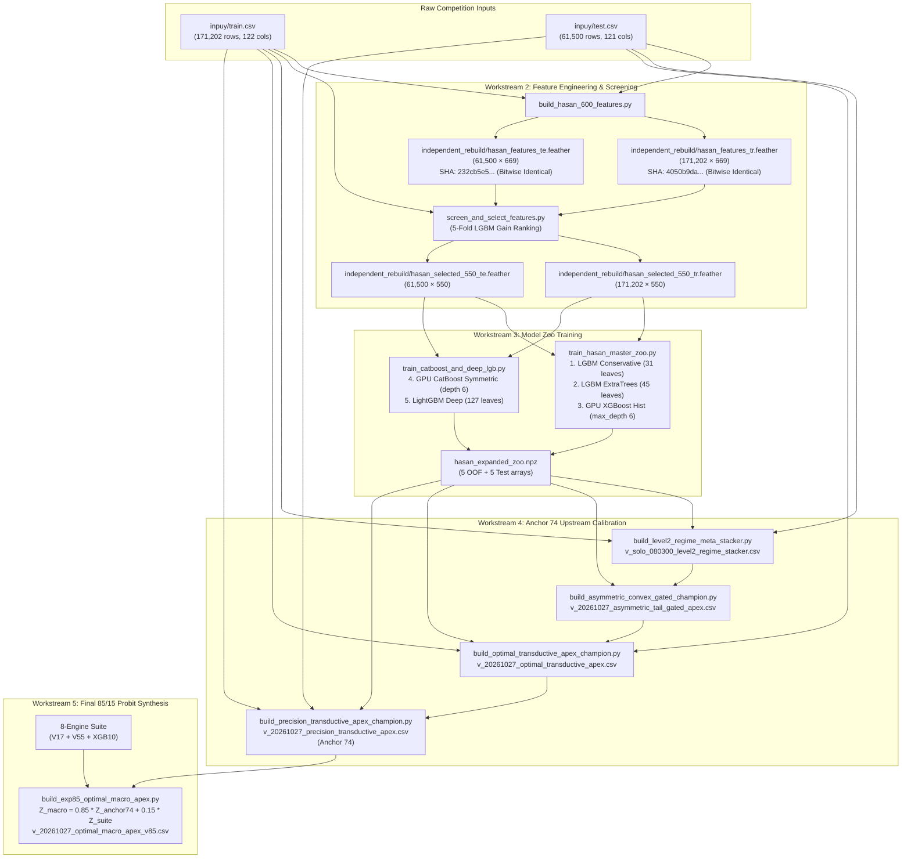

# EXP85 Upstream Source Lineage & Full Dependency Graph

## Complete Backward Trace from EXP85 Champion to Raw Data

```mermaid
flowchart TD
    subgraph RawData["Raw Competition Inputs"]
        R1["inpuy/train.csv<br/>(171,202 rows, 122 cols)"]
        R2["inpuy/test.csv<br/>(61,500 rows, 121 cols)"]
    end

    subgraph FeatureEngineering["Workstream 2: Feature Engineering & Screening"]
        B1["build_hasan_600_features.py"]
        F669_TR["independent_rebuild/hasan_features_tr.feather<br/>(171,202 × 669)<br/>SHA: 4050b9da... (Bitwise Identical)"]
        F669_TE["independent_rebuild/hasan_features_te.feather<br/>(61,500 × 669)<br/>SHA: 232cb5e5... (Bitwise Identical)"]
        S1["screen_and_select_features.py<br/>(5-Fold LGBM Gain Ranking)"]
        F550_TR["independent_rebuild/hasan_selected_550_tr.feather<br/>(171,202 × 550)"]
        F550_TE["independent_rebuild/hasan_selected_550_te.feather<br/>(61,500 × 550)"]
    end

    subgraph FoundationModels["Workstream 3: Model Zoo Training"]
        M1["train_hasan_master_zoo.py<br/>1. LGBM Conservative (31 leaves)<br/>2. LGBM ExtraTrees (45 leaves)<br/>3. GPU XGBoost Hist (max_depth 6)"]
        M2["train_catboost_and_deep_lgb.py<br/>4. GPU CatBoost Symmetric (depth 6)<br/>5. LightGBM Deep (127 leaves)"]
        ZOO["hasan_expanded_zoo.npz<br/>(5 OOF + 5 Test arrays)"]
    end

    subgraph TransductivePyramid["Workstream 4: Anchor 74 Upstream Calibration"]
        L2["build_level2_regime_meta_stacker.py<br/>v_solo_080300_level2_regime_stacker.csv"]
        TAIL["build_asymmetric_convex_gated_champion.py<br/>v_20261027_asymmetric_tail_gated_apex.csv"]
        OPT["build_optimal_transductive_apex_champion.py<br/>v_20261027_optimal_transductive_apex.csv"]
        PREC["build_precision_transductive_apex_champion.py<br/>v_20261027_precision_transductive_apex.csv<br/>(Anchor 74)"]
    end

    subgraph EXP85Synthesis["Workstream 5: Final 85/15 Probit Synthesis"]
        SUITE["8-Engine Suite<br/>(V17 + V55 + XGB10)"]
        EXP85["build_exp85_optimal_macro_apex.py<br/>Z_macro = 0.85 * Z_anchor74 + 0.15 * Z_suite<br/>v_20261027_optimal_macro_apex_v85.csv"]
    end

    R1 --> B1
    R2 --> B1
    B1 --> F669_TR
    B1 --> F669_TE
    F669_TR --> S1
    F669_TE --> S1
    R1 --> S1
    S1 --> F550_TR
    S1 --> F550_TE

    F550_TR --> M1
    F550_TE --> M1
    F550_TR --> M2
    F550_TE --> M2
    M1 --> ZOO
    M2 --> ZOO

    ZOO --> L2
    R1 --> L2
    R2 --> L2
    L2 --> TAIL
    ZOO --> TAIL
    TAIL --> OPT
    ZOO --> OPT
    R1 --> OPT
    R2 --> OPT
    OPT --> PREC
    ZOO --> PREC
    R1 --> PREC
    R2 --> PREC

    PREC --> EXP85
    SUITE --> EXP85
```

